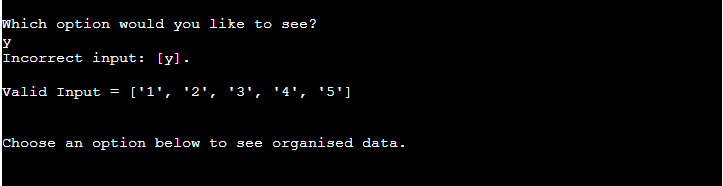

# Survey Response Handler

## Intended Purpose of This Application:

This application is intended to handle the responses given to a survey, which was sent out to people to fill in via a Google Form. The survey has 21 different questions. The questions posed to the respondent result in numerical/qualitative data that the program can analyse and return organised data back to the user. The responses to these questions are all recorded on a Google Sheets worksheet which is linked to the form. The survey questions are intended to gather information relating to how much time people spend on social media and how they feel after using the various different social media platforms. 

Link to the Google Form used to carry out the survey: [Google Form Link](https://docs.google.com/forms/d/1gyEQpgbYgeGzc19Oi-IdQpPc_qcEAuxyAMB8eVllUzY/edit?usp=sharing) 

Link to the Google Sheet storing the response data: [Google Sheets Link](https://docs.google.com/spreadsheets/d/16IcQIKeoByhsuDIfVVUuOrqRdb6ImJ_Ck_sUPGSkVFM/edit?usp=sharing)

Link to the live application hosted on heroku: [Live site](https://survey-response-handler.herokuapp.com/)

## Important Note:

-   One important item to note is that there is a counter that is updated on lines 57-58 of run.py, this is commented out to allow the tester of this application to repeatedly run the program. The counter should update with the new row total so it can tell if the form has new survey responses or the data there has already been viewed. If the comments are removed the counter will function as intended.

- Another item to note is that if you try to get the full table of responses back multiple times in under a minute you will exhuast the API requests and get an error returned. This is to avoid spamming the API. 

# Table of Contents:

-   [Planning](https://github.com/gfpkelly1986/survey-response-handler#planning-process-for-this-project)

-   [Live Features](https://github.com/gfpkelly1986/survey-response-handler#live-features)

-   [Desired Features](https://github.com/gfpkelly1986/survey-response-handler#desired-features)

-   [Validator Testing](https://github.com/gfpkelly1986/survey-response-handler#validator-testing)

-   [Libraries Used](https://github.com/gfpkelly1986/survey-response-handler#libraries-used)

-   [Record of Useful Python Methods Used](https://github.com/gfpkelly1986/survey-response-handler#record-of-useful-python-methods-used)

-   [Bugs During Development](https://github.com/gfpkelly1986/survey-response-handler#bugs-during-development)

-   [Deployment](https://github.com/gfpkelly1986/survey-response-handler#deployment)

-   [Credits](https://github.com/gfpkelly1986/survey-response-handler#credits)

# Planning Process for This Project:
Live link to published version of Lucid Chart: [Lucid Chart](https://lucid.app/publicSegments/view/af9a8c15-faaa-47e8-86e8-0fe8337d9484/image.jpeg)

## Screenshot of Flow Chart Used for Planning:

To begin the planning process for this project I constructed a flow chart so that a clear picture could be established of what decisions the program would be required to make and when those decisions needed to occur. The creation of this chart allowed me to step through the journey a user would take while using the program. It also helped me to think and plan for what data I would need, what I could do with this data and how I might return it to the user. Additionally, once this flow chart was created it gave me a foundation to work from so I could better understand what functions I would need to create to get the behaviour I wanted from the program.
The limitations of an 80 character width in the terminal meant a lot of thought had to go in to how the program might present this data.

## Screenshot of First Draft of Function Creation:

## How the Functions Evolved During Development:

# Live Features:
- Ability to check the survey responses for new entries and see a table of all responses

- Ability to update the sheet so it knows the new total of responses

- View a table of all responses

- View age related data. How long various age categories spend on social media

- View top platform for feelings of happiness

- View top platform for feelings of connectedness

- View top platform for feelings of anxiousness

- View top performer keeping users Informed

- Input validation at the beginning of the program. Validating string input for yes and no answers.

- Input validation when expecting inputs of ['1','2','3','4','5']

- Ability to respond to new entries to the sheet. New totals and tables built and returned as new entries come in up to a limit of 50 responses.

# Desired Features:
- Return tables of data in a leaderboard style of table so 2nd, 3rd and 4th in each category can also be seen clearly, not just the top performer for each category.
- Ability to update the worksheets with comments relating to the organised data that was returned.

# Validator Testing:
-Testing for this application was done with the PEP8 online checker.
Link to site used: [PEP8 Online Checker](http://pep8online.com/checkresult) 

# Libraries Used:
- Operator from itemgetter
    - This library was used on line 404 of run.py:
    `get = itemgetter(slice(0, 4), slice(4, 8), slice(8, 12), slice(12, 16))`.
    This allowed me to set up a variable that sliced a list at certain indexes in one line of code which greatly reduced the complexity of getting the values I needed. 
    Some documentation for this library can be found at this link: [itemgetter](https://xxx-cook-book.gitbooks.io/python-cook-book/content/Sort/Operator.itemgetter.html)
- Sys
    - This library is used at line 458 to close the program using the exit method. `sys.exit()`.
- Pyfiglet
    - This library was used for the styled title at the beginning of the program. Documentation for pyfiglet can be found at this link: [pyfiglet](https://www.javatpoint.com/python-pyfiglet-module)
- Gspread
    - The gspread library was used to get and set data in the Google sheet. Documentation for gspread can be found at this link: [gpread](https://docs.gspread.org/en/v5.4.0/)
- google.oauth2.service_account from credentials
    - The credentials module from google.oauth allows the program to connect to Google Sheets via an API.
- Tabulate from tabulate
    This Library was used to display the full form and the age related form in tables in the terminal in a 'grid' format.

# Record of Useful Python Methods Used:

- The sum method for summing values from iterables.` sheet2_col_totals = [str(sum(x)) for x in sheet2_col_totals]` 

- The batch_get() method of the gspread library which is very useful to reduce API calls: ` col_values_anxious = SHEET.worksheet('Anxious').batch_get(['B2:B50', 'C2:C50', 'D2:D50', 'E2:E50'])`

- The itemgetter method from the itemgetter library, extremely useful for slicing large data structures: `get = itemgetter(slice(0, 4), slice(4, 8), slice(8, 12), slice(12, 16))` 

- The map() method is used to apply a function on all the elements of specified iterable and return map object. It is used when you want to apply a single transformation to all the iterable elements`total = [(sum(map(int, list_of_values)))]`. This code converted all the string values contained within a list into integers so they could be summed in one line of code.

-  The max method allowed me to get the highest values in the dictionary of social media platforms `platform_dict = {'Facebook': (leading_platforms[3][0][0]),'Instagram': (leading_platforms[3][0][1])'Twitter': (leading_platforms[3][0][2]),'Linked-In': (leading_platforms[3][0][3])}top_platform = max(platform_dict, key=platform_dict.get) top_platform = max(platform_dict, key=platform_dict.get)`. 
    - Some documentation for this method can be found here: [max method](https://python-reference.readthedocs.io/en/latest/docs/functions/max.html)

# Bugs During Development:

- The biggest issue I had during this project was unpacking large data structres to get the values I needed for calculations. It also took some time to realise that when passing in [['one','two','three']]
to the update function of the gspread library, it will attempt to fill a row of data. If you pass it 
[['one'],['two'],['three']] it will attempt to fill a column of data. That took some time to figure out by testing various outputs in the terminal.

- Small bug where my options were in the reverse order to how my method was returning them to the terminal.

# Deployment:

- 3 Code Institute instructions that were noted before deployment:
    - An extra key:value pair of port:8000 was required in Heroku.
    - All input methods need \n at the end for the mock terminal to behave properly
    - pip3 freeze > requirements.txt will put the required dependencies into the requirements.txt file so Heroku installs the correct library when it builds the application.

- Main steps to deploy this project to Heroku:
    1.  Make sure the most up to date files are pushed to github repository
    2.  Create a new app from the Heroku dashboard.
    3.  Application will need a name and a region selected
    4.  Select the settings tab
    5.  Convig vars = Enviornment variable. This is sensitve data! Creds.json goes in this field as follows: CREDS:creds.json
    6.  Select 'Add buildpack' Order is important! Python must be on top of Node.js
    7.  Go to the Deploy tab and select it.
    8.  To connect your project to github, search your repository and click 'connect'
    9.  Enable automatic deploys so each new git push command is recognised
    10. Manually deploy from the main branch
    11. Click view to see your deployed site.

# Credits:

- The Code Institute provided the mock terminal used to display this project in the browser.

