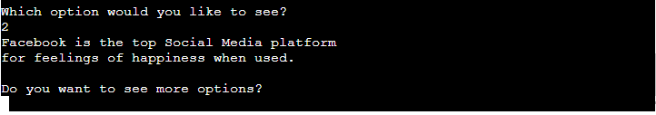

# Survey Response Handler

## Intended Purpose of This Application:

This application is intended to handle the responses given to a survey, which was sent out to people to fill in via a Google Form. The survey has 21 different questions. The questions posed to the respondent result in numerical/qualitative data that the program can analyse and return organised data back to the user. The responses to these questions are all recorded on a Google Sheets worksheet which is linked to the form. The survey questions are intended to gather information relating to how much time people spend on social media and how they feel after using the various different social media platforms. 

Link to the Google Form used to carry out the survey: [Google Form Link](https://docs.google.com/forms/d/1gyEQpgbYgeGzc19Oi-IdQpPc_qcEAuxyAMB8eVllUzY/edit?usp=sharing) 

Link to the Google Sheet storing the response data: [Google Sheets Link](https://docs.google.com/spreadsheets/d/16IcQIKeoByhsuDIfVVUuOrqRdb6ImJ_Ck_sUPGSkVFM/edit?usp=sharing)

Link to the live application hosted on heroku: [Live site](https://survey-response-handler.herokuapp.com/)

## Important Note

One important item to note is that there is a counter that is updated on lines 57-58 of run.py, this is commented out to allow the tester of this application to repeatedly run the program. The counter should update with the new row total so it can tell if the form has new survey responses or the data there has already been viwed. If the comments are removed the counter will function as intended.

# Planning Process for This Project:
Live link to published version of Lucid Chart: [Lucid Chart](https://lucid.app/publicSegments/view/af9a8c15-faaa-47e8-86e8-0fe8337d9484/image.jpeg)

## Screenshot of Flow Chart Used for Planning:

To begin the planning process for this project I constructed a flow chart so that a clear picture could be established of what decisions the program would be required to make and when those decisions needed to occur. The creation of this chart allowed me to step through the journey a user would take while using the program. It also helped me to think and plan for what data I would need, what I could do with this data and how I might return it to the user. Additionally, once this flow chart was created it gave me a foundation to work from so I could better understand what functions I would need to create to get the behaviour I wanted from the program.
The limitations of an 80 character width in the terminal meant a lot of thought had to go in to how the program might present this data.

## Screenshot of First Draft of Function Creation:

## How the Functions Evolved During Development:

# Live Features:
- Ability to check the survey responses for new entries and see a table of all responses

- Ability to update the sheet so it knows the new total of responses
- View a table of all responses

- View age related data. How long various age categories spend on social media

- View top platform for feelings of happiness

- View top platform for feelings of connectedness
- View top platform for feelings of anxiousness
- View top performer keeping users Informed
- Input validation
- Ability to respond to new entries to the sheet. New totals and tables built and returned as new entries come in up to a limit of 50 responses.

# Desired Features:
- Return tables of data in a leaderboard style of table so 2nd, 3rd and 4th in each category can also be seen clearly, not just the top performer for each category.
- Ability to update the worksheets with comments relating to the organised data that was returned.

